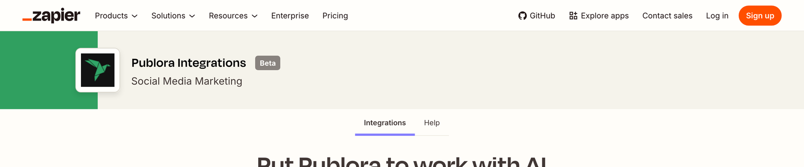
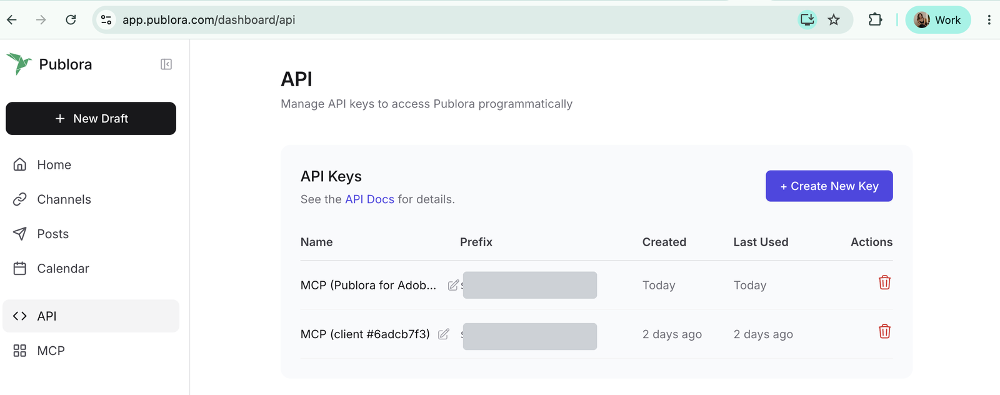
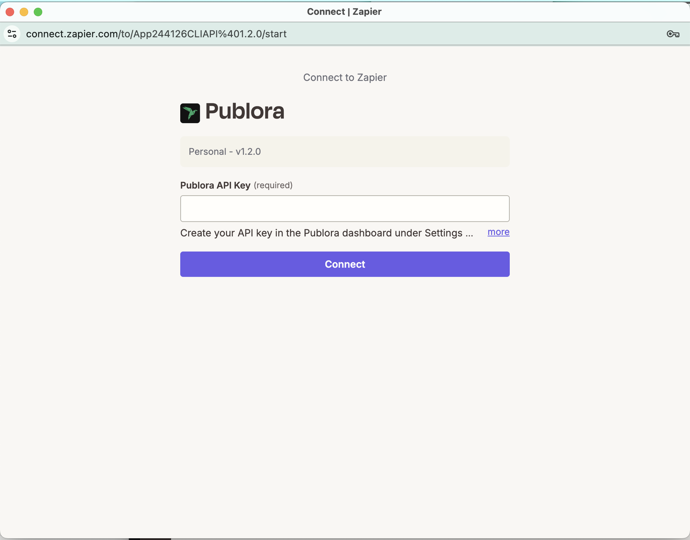
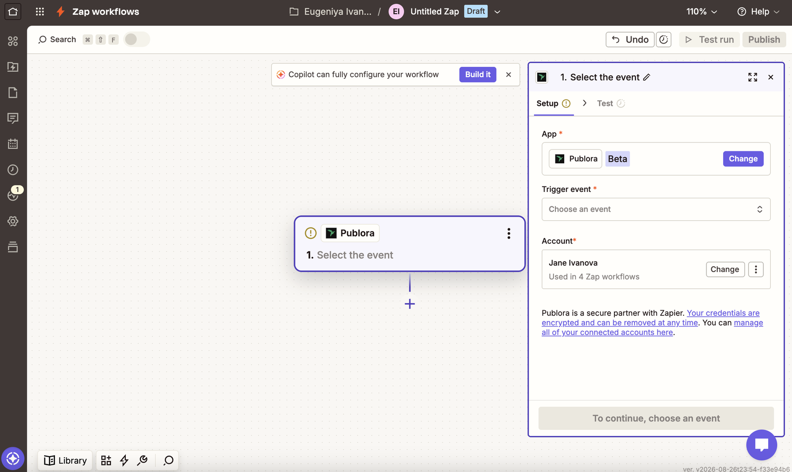
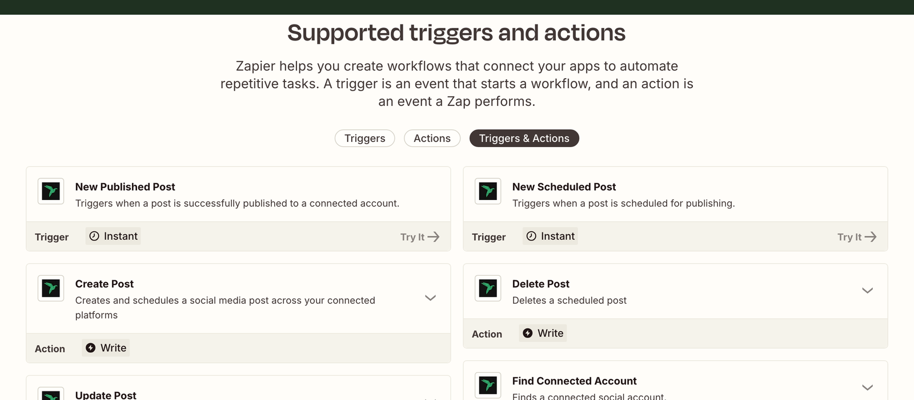
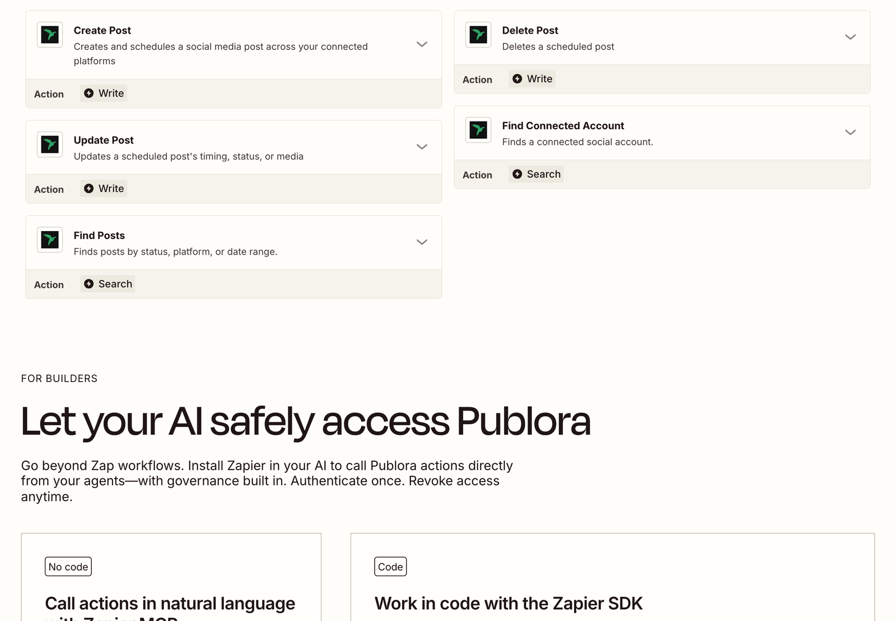
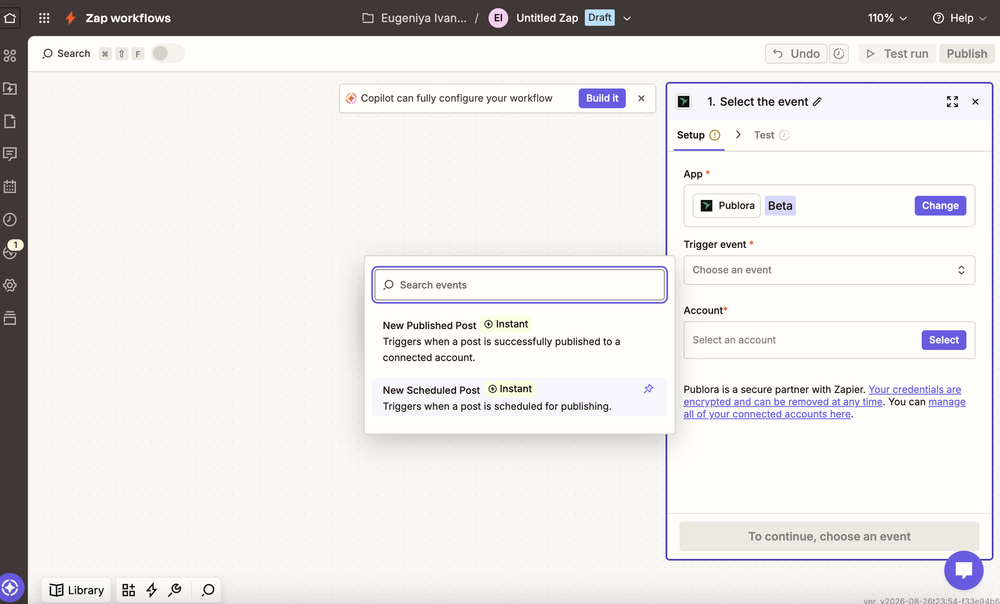
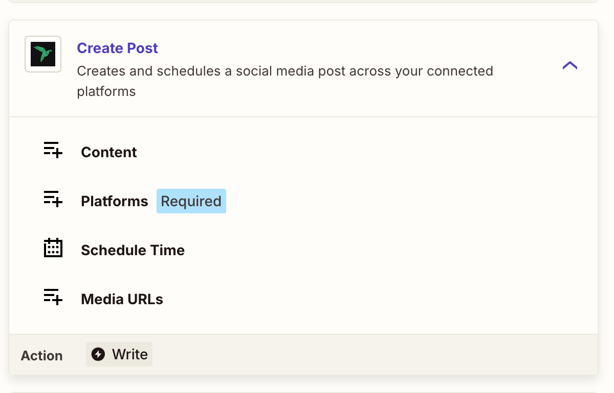
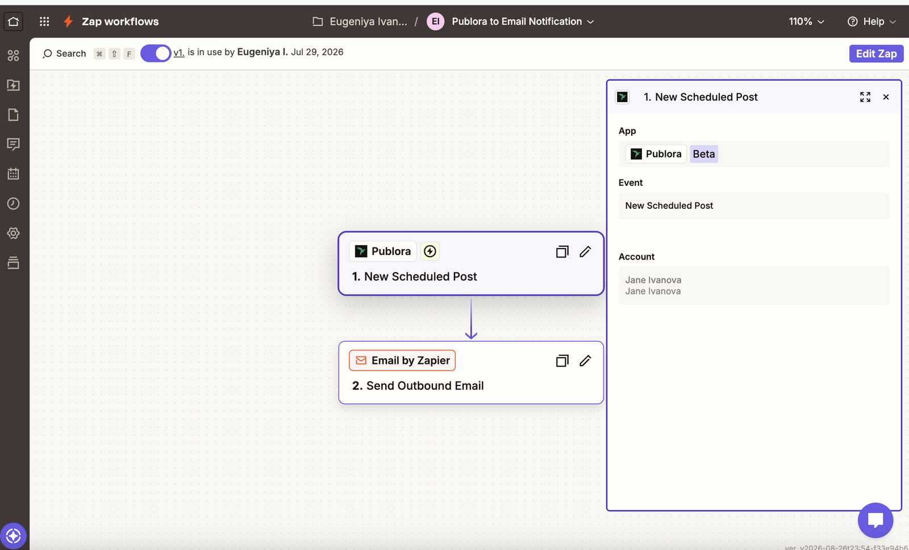

# Zapier Integration

Publora has a native Zapier app, so anything that can start a Zap can also publish to your social accounts. A new row in a spreadsheet, a fresh item in an RSS feed, a message in Slack. Any of them can turn into a scheduled post across your connected platforms, without writing a line of code.

The integration is currently in beta. Everything below works today; the set of triggers and actions will grow.

## Before you start

- A Publora account with at least one connected social account.
- A Zapier account. The free plan is enough for single-step Zaps.

## Step 1 — Get your Publora API key

In the Publora dashboard, open **API** in the left sidebar (or go straight to [app.publora.com/dashboard/api](https://app.publora.com/dashboard/api)) and click **+ Create New Key**. Copy it right away; the full key is shown once, and the list afterwards only keeps a short prefix so you can tell your keys apart.

## Step 2 — Open the Publora app on Zapier

Go to [zapier.com/apps/publora/integrations](https://zapier.com/apps/publora/integrations) and pick a template, or start a Zap from scratch and search for **Publora** in the editor.

## Step 3 — Connect your account

When Zapier asks to connect Publora, paste the key into the **Publora API Key** field and click **Connect**. Zapier checks it by fetching your connected accounts, so a wrong key fails immediately instead of later.

Once it goes through, the account shows up in the step and can be reused by every other Zap you build. You can manage the connection any time at [zapier.com/app/connections](https://zapier.com/app/connections).

## Step 4 — What you can build

**Triggers** (Publora starts the Zap). Both are instant: Publora pushes the event to Zapier the moment it happens, instead of Zapier polling for changes on a schedule.

- **New Published Post** — a post was published to a connected account
- **New Scheduled Post** — a post was scheduled for publishing

**Actions** (Publora does something):

- **Create Post** — creates and schedules a post across your connected platforms
- **Update Post** — changes a scheduled post's timing, status, or media
- **Delete Post** — deletes a scheduled post

**Searches:**

- **Find Connected Account** — looks up a connected social account
- **Find Posts** — finds posts by status, platform, or date range

## Example: publish new blog posts automatically

Wire up **RSS by Zapier → New Item in Feed** as the trigger, then **Publora → Create Post** as the action. Picking the event takes one click:

Create Post has four fields:

Pick your accounts under **Platforms**. The dropdown lists the accounts you've connected in Publora, so there are no IDs to copy by hand. Map the feed's title and link into **Content**, and either leave **Schedule Time** empty to create a draft or set a time to schedule it. Test the step, then publish the Zap. Every new post in the feed now becomes a post on your networks.

## Example: get alerted when something publishes

Use **Publora → New Scheduled Post** or **New Published Post** as the trigger, then send it wherever you keep an eye on things: **Email by Zapier** for a notification, **Google Sheets → Create Row** for a running log, or **Slack → Send Channel Message** for a ping.

## More ideas

- New row in Google Sheets → Create Post, scheduled from a column
- New item in a Notion database → Create Post
- New WordPress post → Create Post, announcing it on your networks
- New Airtable record with status Approved → Create Post
- Schedule by Zapier, weekly → Create Post for a recurring digest

## Tips and troubleshooting

- Leaving **Schedule Time** empty creates a draft, not an immediate post.
- Instagram, TikTok, and YouTube require media. Pass public `https` URLs in **Media URLs**.
- You can't update a post that has already published. Deleting a published post removes it from Publora, but not from the platforms it already went out to.
- Times are ISO 8601, in UTC, and **Schedule Time** must be in the future. Zaps can queue behind rate limits — if the time you mapped has already passed when the step runs, Publora clamps a small delay to "now" (returning a `SCHEDULED_TIME_COERCED` warning) and rejects anything five or more minutes stale. Add a few minutes of buffer.

## Calling the API directly

The Zapier app covers scheduling, editing, and publishing events. If you need an endpoint it doesn't expose, you can still call the Publora API from a **Webhooks by Zapier** step: send a POST to `https://api.publora.com/api/v1/create-post` with your key in the `x-publora-key` header. See [Authentication](../../authentication.md) for the key setup and [Core Workflows](../curl/all-endpoints.md) for every endpoint in curl form.
